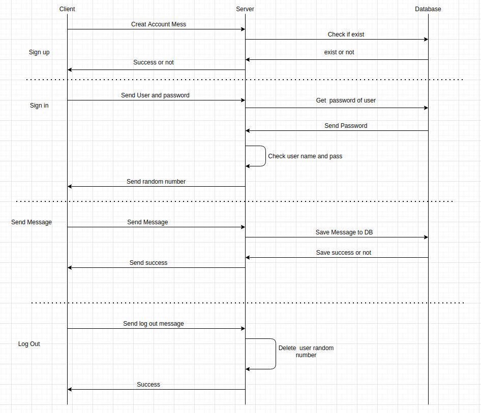

# **Thiết kế  ứng dụng chat đơn giản sử dụng grpc** 

* Sơ đồ ứng dụng chat sử dụng grpc
    

* Thiết kế message giao tiếp giữa Client và Server 
    
        message User (){
            int id =1;
            string display_name=2;
            string password =3;
        }

        //user command to request for sign up , sign in rand_number,  //and message recived from other user and channel

        message User_command(){
            User user=1;
            string command=2; //command is sign up , sign in, request //online user , request received message 
            int channel_id =3;
            int user_id =4;
        }
        message User_respond(){
            User user =1;
            int rand_number=2;
            bool status =3;
        }

        message Message(){
            User user =1;
            int rand_number=2;
            string type =3 // private or group
            int receiver_id =4;
            int channel_id =5
            string message =6;
            string timestamp =7;
        }
        service Broadcast{
            rpc ;
            rpc BroadcastMessage (Message) returns (Close);
}

